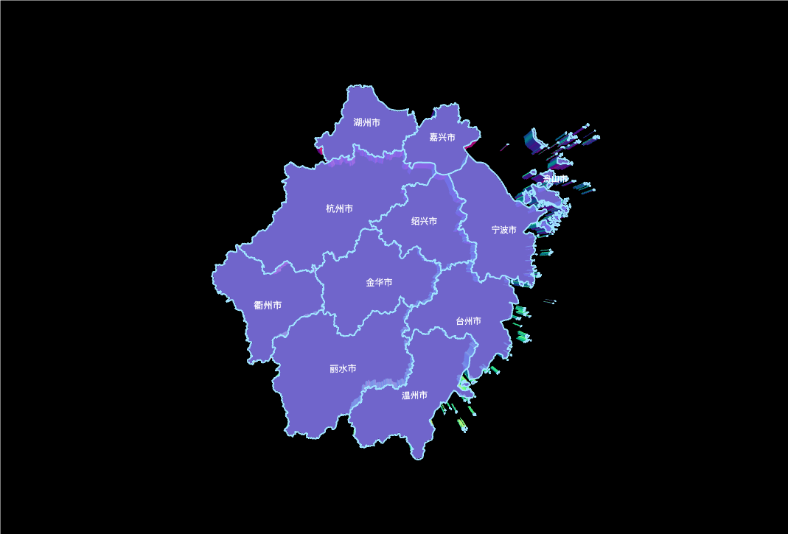

# Getting Started 

## Installation 

### Prerequisites 

- [Node.js](https://nodejs.org/) version 18 or higher.。

three-auto you can install it with：

::: code-group

```sh [npm]
$ npm add -D three-auto
```

```sh [pnpm]
$ pnpm add -D three-auto
```

```sh [yarn]
$ yarn add -D three-auto
```


:::

::: tip 

three-auto is an ESM-only package. Don't use require() to import it, and make sure your nearest package.json contains "type": "module", 。

:::

:::tip three.js as peer dependency
If you intend to perform customization that uses Three.js components or APIs，you should also explicitly install three as a dependency.If your project is using `typescript`, you should also install `@types/three`.
:::

## Into the project

When you want to create an auto-three instance, you first need a canvas DOM root node or a virtual DOM node (supported by frameworks like Vue and React) to render a Three.js scene.


- `index.html`
```html {10,12}
<canvas class="webgl" id="_scene"></canvas>
<script type="module" src="./main.ts"></script>  
```


:::tip
Please give the canvas or its parent container a width and height so that the scene can be displayed.
:::

- `main.ts`
```ts
import * as AUTO from "three-auto";
import * as THREE from "three";

const instance = new AUTO.ThreeAuto();
const geometry = new THREE.BoxGeometry(1, 1, 1);
const material = new THREE.MeshBasicMaterial({
  color: "#E89ABE",
  transparent: true,
});
const box = new THREE.Mesh(geometry, material);

instance.scene.add(box);

instance.time.on("tick", () => {
  box.rotation.y = instance.time.elapsedTime;
});

```

:::tip
By default, if the container id of the canvas is `_scene`, we don't need to manually get the DOM element.
:::


You should see a pink cube spinning in the center of the screen!


## Chart Mode
The above introduces how to introduce three-auto into the project, but obviously this is not enough. Let me see how to render a 3D map!

- `main.ts`
```ts
import * as AUTO from "three-auto";
import ZheJiangCity from '../public/ZheJiangCity.json'

// Specify the chart's configuration items and data
const instance = new AUTO.ThreeAuto(undefined, {
  id: "_scene",
  name: "Hello three auto",
  camera: {
    type: 'PerspectiveCamera',
    fov: 75,
    near: 0.1,
    far: 1000,
    position: {
      x: 0,
      y: 0,
      z: 20,
    },
    lookAt: true,
    controls: {
      enable: true,
      enableDamping: true,
      enablePan: true,
    },
  },
  size: {
    type: "window",
    id: "",
  },
  renderer: {
    antialias: true,
    alpha: true,
    clearAlpha: 1,
    clearColor: '#000000',
  },
  series: [
    {
      name: "Contour map",
      id: 0,
      type: "map",
      json: ZheJiangCity,
      itemStyle: {
        depth: 1,
        bevelEnabled: false,
        bevelSegments: 1,
        bevelSize: 0,
        bevelThickness: 0,
        extrudeFaces: {
          material: 'MeshNormalMaterial',
          color: "#ccc",
          opacity: 1,
          metalness: 1,
          roughness: 1,
        },
        crossSection: {
          material: 'MeshNormalMaterial',
          opacity: 0.8,
          color: "#000",
        },
        lineStyle: {
          show: true,
          color: "#A0E5FF",
          width: 2,
        },
        label: {
          show: true,
          distance: 1.3,
          rotation: {
            x: 0,
            y: 0,
            z: 0,
          },
          textStyle: {
            padding: '8px',
            'font-size': '20px',
            color: "#fff",
            bold: true,
            'font-weight': 400,
            'font-style': 'normal',
          },
        },
      },
    },
  
});

// log three-auto instance
console.log(instance)

```

:::tip
And that’s it! Your first chart is created!
:::

